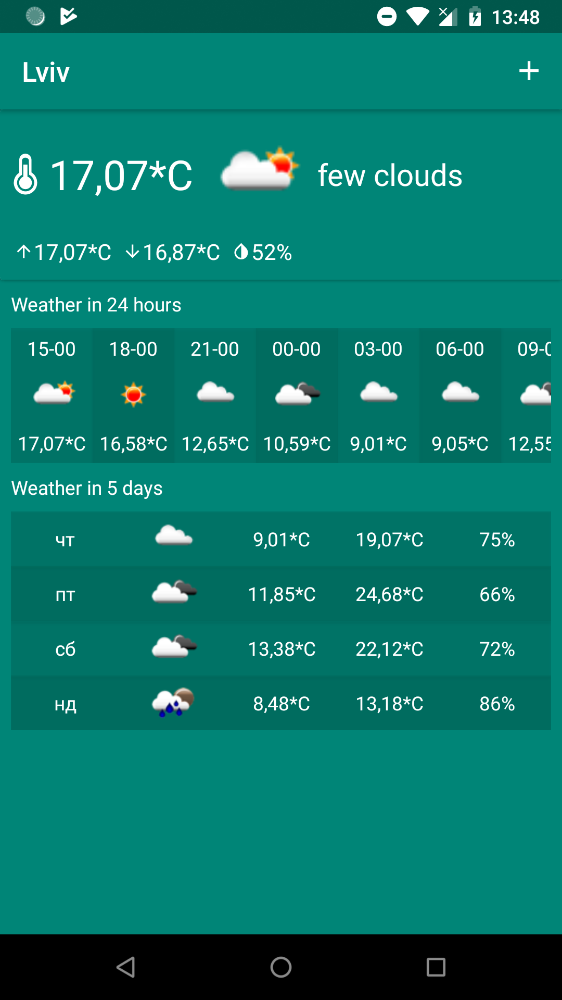
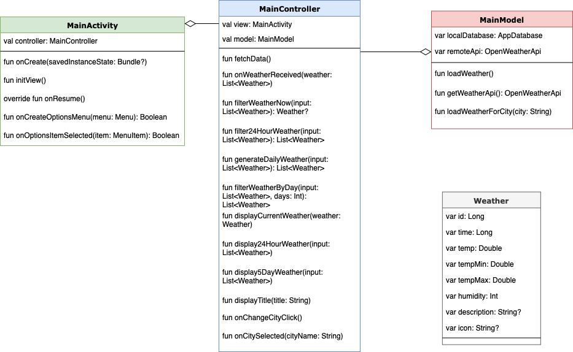
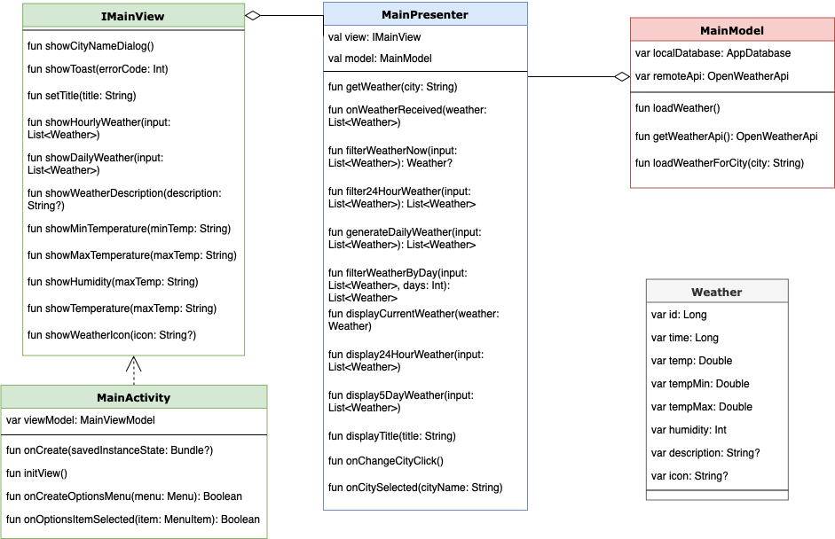
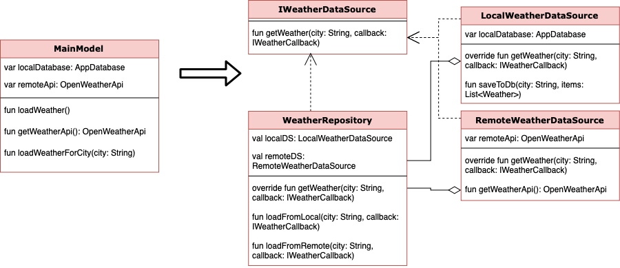
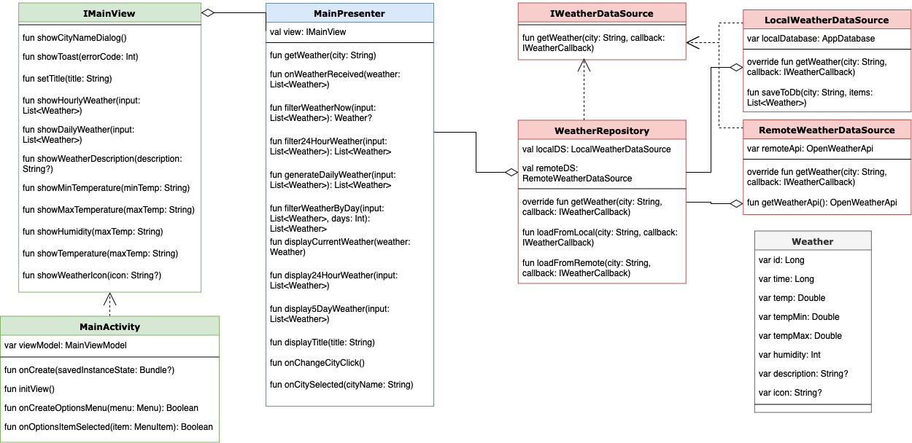
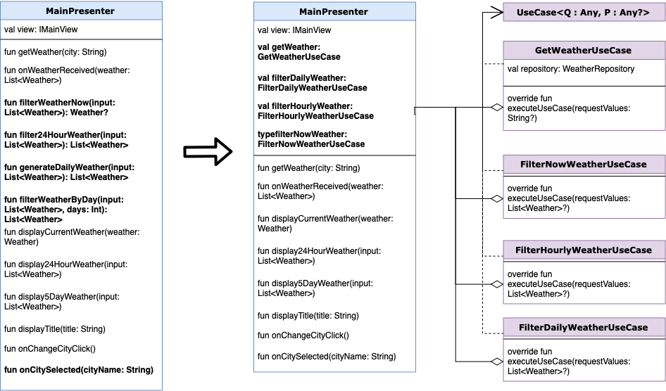
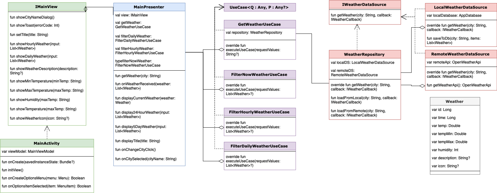
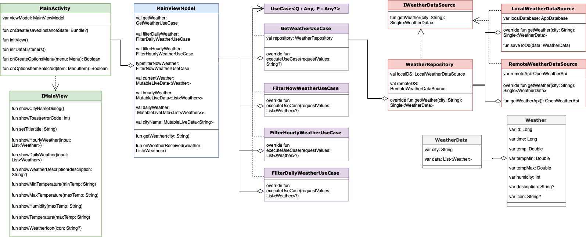
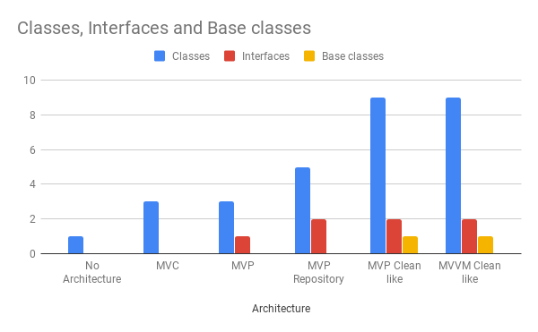
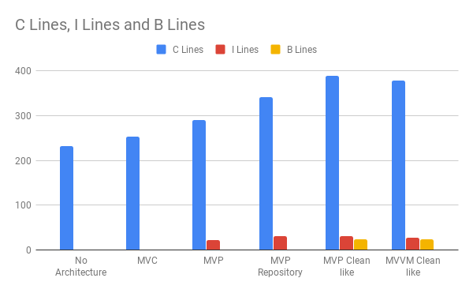

# Android Architecture Tutorial
This sample project shows use of different architecture patterns.

This is a weather application which displays information about:

- current weather

- 24 hour weather

- 5 day weather

Application load information from server and store information locally.

User is able to change the city.

  

  
  

 At the begining, all logic is stored in MainActivity class.

## General project transformation 
Project improvements were divided into several steps:

- Step 1: Use MVC architecture to seperate business and presentation logic.

- Step 2: Use MVP to hide View from Presenter and increase testing capabilities.

- Step 3: Use Repository and Data Sources to manage local database and get data from remote server.

- Step 4: Implement Use Cases to move business logic out from Presenter.

- Step 5: Migrate to MVVM to support reactive components.

  
## Step 1: Use MVC architecture to seperate business and presentation logic.

Source code is present at: https://github.com/TeslyukTaras/AndroidTutorial_Architecture/tree/mvc
General Class diagram:

  

  
  

    
## Step 2: Use MVP to hide View from Presenter and increase testing capabilities.

Source code is present at: https://github.com/TeslyukTaras/AndroidTutorial_Architecture/tree/mvp  
General Class diagram:

  

  
  

    
## Step 3: Use Repository and Data Sources to manage local database and get data from remote server.

Source code is present at: https://github.com/TeslyukTaras/AndroidTutorial_Architecture/tree/mvp_repository_datasource
Key point is to divide Model into several parts:

- Repository, which manage Data Sources and take decisions which one to use.

- Local data source, which work with local DB.

- Remote data source, which work with remote server.

  

  
  

General Class diagram will transform to:

  

  
  

    
## Step 4: Implement Use Cases to move business logic out from Presenter.

Source code is present at: https://github.com/TeslyukTaras/AndroidTutorial_Architecture/tree/mvp_clean_architecture
Key point is to move business logic to separate classes:

- Use Case to load weather data.

- Use Case to find current weather.

- Use Case to filter 24hour weather.

- Use Case to find 5 day weather.

  

  
  

General Class diagram will transform to:

  

  
  

    
## Step 5: Migrate to MVVM to support reactive components.

Source code is present at: https://github.com/TeslyukTaras/AndroidTutorial_Architecture/tree/mvvm
  

  
  

What is next:

- Save information about selected Cities.

- Improve MVVM sample to use DataBinding from JetPack.

- Integrate Dagger2.

## Results
Let's compare different architectures and extensions by the next criterias:

- Class count

  

  
  

- Lines of code

  

  
  

